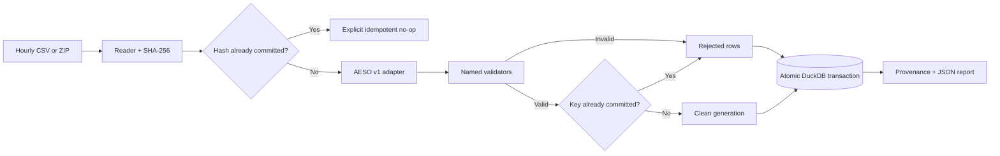

# AESO Generation Data Pipeline

[](https://github.com/JoelObinnaEze/aeso-generation-pipeline/actions/workflows/ci.yml)


A production-minded Python ingestion component for the Alberta Electric System Operator (AESO) Current Supply and Demand historical generation dataset. It turns one hourly CSV or ZIP artifact into validated, queryable DuckDB tables with deterministic quarantine, file-level provenance, schema-version tracking, and replay-safe batch semantics.

> **Verified full-month run:** 165,168 hourly observations across 230 assets, with 0 rejected rows and 0 duplicate `(asset_id, timestamp)` keys from the June 2026 AESO archive.

## Engineering highlights

| Concern | Implementation |
|---|---|
| Repeatable ingestion | SHA-256 source identity makes an exact replay an explicit zero-write no-op |
| Cross-batch consistency | Existing observations win; incoming overlaps are quarantined under `reject_incoming` |
| Data quality | Stable reason codes, raw-record retention, and one deterministic rejection reason per row |
| Auditability | Source URL, retrieval time, hash, adapter version, policy, counts, and status are persisted |
| Schema drift | Exact versioned source contract fails closed instead of guessing at renamed or reordered fields |
| Storage safety | Clean rows, rejects, and provenance commit in one DuckDB transaction with uniqueness guards |
| Delivery quality | 27 automated tests plus clean-checkout CI on Python 3.11 and 3.13 |

This is intentionally a focused ingestion boundary, not a dashboard or forecasting project. The goal is to make operational source data trustworthy before downstream analysis begins.

## Architecture



The source-specific contract lives in the adapter. Reading, canonical validation, orchestration, storage, and inspection remain separate so each boundary can be tested independently.

## Quick start

Python 3.11 or newer is required.

```powershell
git clone https://github.com/JoelObinnaEze/aeso-generation-pipeline.git
cd aeso-generation-pipeline

python -m venv .venv
.\.venv\Scripts\Activate.ps1
python -m pip install -r requirements.txt
python -m pip install --no-deps -e .

python -m pytest
aeso-ingest --input data\sample\aeso_hourly_sample.csv --db data\aeso.duckdb
aeso-inspect --db data\aeso.duckdb
```

On macOS or Linux, activate with `source .venv/bin/activate` and use forward slashes in paths.

The sample command creates two ignored local artifacts:

- `data/aeso.duckdb` with clean, rejected, provenance, and schema-version tables;
- `data/aeso.validation.json` with batch counts, status, reason totals, policy, and source identity.

The inspection command is read-only and returns stable JSON suitable for a terminal demo or automated health check:

```json
{
  "batch_count": 1,
  "clean_row_count": 165168,
  "database_schema_version": 2,
  "distinct_asset_count": 230,
  "duplicate_key_group_count": 0,
  "rejected_row_count": 0
}
```

## Run the real AESO archive

Download an hourly ZIP from the official [AESO Historical Generation Data (CSD)](https://www.aeso.ca/market/market-and-system-reporting/data-requests/historical-generation-data/) page and place it under `data/raw/`. The pipeline reads the ZIP directly; manual extraction is unnecessary.

```powershell
aeso-ingest `
  --input "data\raw\CSD Generation (Hourly) - 2026-06.zip" `
  --db data\aeso-full.duckdb

aeso-inspect --db data\aeso-full.duckdb
```

`--retrieved-at` accepts an offset-aware ISO-8601 timestamp. If omitted, the input file modification time is recorded as the best local retrieval-time approximation. `--source-url`, `--report`, and `--overlap-policy` are also explicit CLI options.

## Source contract

The `aeso-csd-hourly-v1` adapter was built against the observed 12-column AESO hourly layout:

```text
Date (MST),Date (MPT),Asset Short Name,Asset Name,Asset Grouping,Volume,Maximum Capability,System Capability,Fuel Type,Sub Fuel Type,Planning Area,Region
```

| Raw field | Clean field | Rule |
|---|---|---|
| `Date (MST)` | `timestamp` | Parse exact `YYYY-MM-DD HH:MM:SS` at fixed UTC-07:00, then store as `TIMESTAMPTZ` |
| `Asset Short Name` | `asset_id` | Trim whitespace; reject blank identifiers |
| `Asset Name` | `asset_name` | Trim whitespace; convert blank values to `NULL` |
| `Volume` | `generation_mw` | Parse a finite `DOUBLE`; reject blank, text, NaN, and infinity |

The fixed-offset MST field is used instead of the naive MPT clock to avoid daylight-saving ambiguity. DuckDB stores an absolute instant; display timezone depends on the SQL session.

## Deterministic validation and quarantine

| Reason code | Trigger | Result |
|---|---|---|
| `MISSING_TIMESTAMP` | Timestamp is empty | Quarantine row |
| `INVALID_TIMESTAMP` | Timestamp cannot be parsed | Quarantine row |
| `MISSING_ASSET_ID` | Asset identifier is empty | Quarantine row |
| `NON_NUMERIC_GENERATION` | Volume is blank, nonnumeric, NaN, or infinite | Quarantine row |
| `DUPLICATE_RECORD` | Key repeats inside one artifact | Keep first; quarantine later occurrence |
| `CROSS_BATCH_OVERLAP` | A different artifact repeats a committed key | Keep existing; quarantine incoming row |
| `WRONG_COLUMN_STRUCTURE` | Header or row shape differs from the contract | Quarantine row or reject batch |
| `EMPTY_FILE` | No CSV header exists | Reject batch and preserve provenance |
| `OTHER_MALFORMED_ROW` | CSV, ZIP, or adapter error | Quarantine with diagnostic detail |
| `MISSING_PROVENANCE_METADATA` | Required source metadata is absent | Reject without fabricating provenance |

Rejected records preserve their source line, best-effort canonical fields, full raw record as JSON, reason code, explanation, source metadata, and ingestion time. Invalid input is never silently discarded.

## Repeatable batch behavior

### Exact artifact replay

SHA-256 is calculated before parsing. If that hash already exists in committed provenance, the run returns `status: skipped_idempotent`, references the original batch, and writes zero clean, rejected, or provenance rows. A unique index enforces the same guarantee at the storage boundary.

### Different artifact, overlapping key

For a different hash containing an existing `(asset_id, timestamp)`, the explicit policy is `reject_incoming`:

- the existing clean observation remains unchanged;
- the incoming conflict receives `CROSS_BATCH_OVERLAP`;
- non-overlapping rows in the same artifact can still load;
- the selected policy is recorded in both provenance and the JSON report.

This preserves history without inventing corrected-publication semantics that AESO has not supplied.

## DuckDB model

| Table | Purpose |
|---|---|
| `clean_generation` | Canonical timestamp, asset, MW value, and source lineage |
| `rejected_rows` | Raw failed records plus stable reason codes and diagnostics |
| `provenance` | One row per committed artifact with counts, hash, versions, and policy |
| `pipeline_schema` | Local database schema version used for safe migration checks |

Example audit queries:

```sql
SELECT reason_code, count(*)
FROM rejected_rows
GROUP BY reason_code
ORDER BY reason_code;

SELECT source_file, row_count, clean_row_count, rejected_row_count,
       source_sha256, adapter_schema_version, overlap_policy, status
FROM provenance
ORDER BY ingested_at DESC;

SELECT asset_id, timestamp, count(*) AS occurrences
FROM clean_generation
GROUP BY asset_id, timestamp
HAVING count(*) > 1;
```

## Project layout

```text
aeso_pipeline/
  adapter.py      AESO schema mapping and timestamp semantics
  readers.py      CSV/ZIP handling and source hashing
  validation.py   Dataset-independent validators and reason codes
  pipeline.py     Batch orchestration and deterministic precedence
  storage.py      DuckDB schema, migrations, lookups, and transactions
  inspect.py      Read-only operational database summary
  run.py          Ingestion CLI
tests/             Focused unit and integration tests
data/sample/       Small public-schema fixture; full archives stay local
```

## Verification and compatibility

GitHub Actions installs the package from a clean checkout, smoke-tests both CLIs, and runs the complete suite on Python 3.11 and 3.13 for every push and pull request. Tests cover every rejection reason plus valid, mixed, ZIP, idempotent replay, overlap, timezone, migration, and inspection paths.

Upstream schema changes fail closed. The compatibility matrix and adapter migration procedure are in [SCHEMA_COMPATIBILITY.md](SCHEMA_COMPATIBILITY.md). The source-quality boundary is documented in [ASSUMPTIONS.md](ASSUMPTIONS.md), and release history is in [CHANGELOG.md](CHANGELOG.md).

## Scope boundaries

- One bounded hourly artifact is normalized in memory before bulk persistence.
- `reject_incoming` preserves history but does not implement a correction/replacement workflow.
- Remote retrieval, scheduling, dashboards, forecasting, and settlement reconciliation are outside this component.
- AESO states that CSD values are informational and lower quality than settlement-meter data; this pipeline proves structure, lineage, uniqueness, and internal consistency, not the physical truth of every MW observation.
